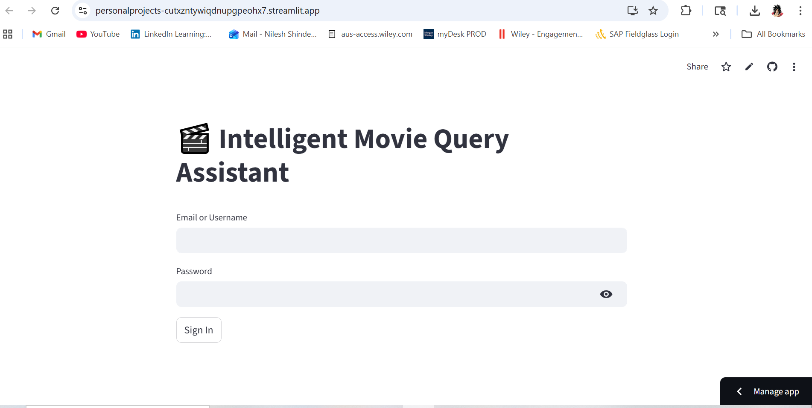

# 🧠 LLM SQL Query Assistant

> **Natural Language → Safe, Validated SQL → Controlled Execution**

An end-to-end **LLM-powered SQL Query Assistant** that converts natural language questions into SQL queries **with enterprise-grade validation, safety checks, and observability**.

This project is designed as a **production-style system**, not just a demo — focusing on *correctness, risk mitigation, and explainability* when using LLMs to query databases.

---

## ✨ Key Features

### 🔍 Natural Language to SQL

* Converts plain-English questions into SQL queries using an LLM
* Supports real-time querying against a PostgreSQL database

### 🛡️ Multi-Layer SQL Validation (Core Differentiator)

* **Syntactic & Structural validation** (query type, tables, clauses)
* **Rule-based safety policies** (read-only enforcement, LIMIT checks, blocked keywords)
* **Cost-aware execution** using query inspection (designed for EXPLAIN-based extensions)
* **Fail-safe blocking** for unsafe or high-risk queries

### 📊 Observability & Control (Phase-2)

* Captures query metadata (execution time, rows returned, failures)
* Designed for integration with metrics dashboards and logs
* Enables future feedback-driven prompt improvements

### 🎛️ Interactive UI (Streamlit)

* Clean login & query interface
* Query results rendered in a tabular, user-friendly format

---

## 🖼️ Application Screenshots

### 🔐 Login Screen



### 📈 Query Results


---

## 🏗️ System Architecture

```text
User Prompt
   ↓
LLM (NL → SQL)
   ↓
SQL Validation Layer
   ├─ Syntax & structure checks
   ├─ Safety rules (read-only, LIMIT, blocked ops)
   ├─ Risk scoring (extensible)
   ↓
Execution Engine
   ↓
PostgreSQL Database
   ↓
Results + Telemetry
```

> 🔎 **Why this matters:** LLMs should never execute SQL blindly. This architecture mirrors how real enterprise systems introduce guardrails between generation and execution.

---

## 📂 Project Structure

```
LLM_SQL_Query_Assistant/
│
├── StreamLit_app/
│   ├── app.py              # Main Streamlit entry point
│   ├── query_page.py       # Query UI & orchestration
│   ├── db/
│   │   └── postgres.py     # PostgreSQL abstraction
│
├── validation/             # SQL safety & validation layers
│   ├── sql_parser.py
│   ├── policy_engine.py
│   ├── risk_engine.py
│
├── observability/          # Metrics & logging (extensible) (Phase-2)
│   └── events.py
│
├── assets/                 # Screenshots & diagrams
│
├── requirements.txt
└── README.md
```

---

## 🧪 Example Queries

* "Show the top 10 highest-rated movies"
* "Which directors have made more than 5 movies?"
* "Average rating by genre"

---

## 🎯 Design Philosophy

* **Safety-first LLM usage** — no blind execution
* **Separation of concerns** — generation ≠ validation ≠ execution
* **Production realism** — observability, metrics, and explainability matter (Phase-2)

This project intentionally prioritizes *robust system design* over UI polish.


## 👤 Author

**Vedant Shinde**